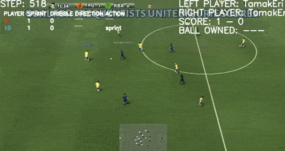

# TamakEriFever: Google Research Football AI Engine

[kaggle competition](https://www.kaggle.com/c/google-football/)

# Usage

## Build docker image

```bash
 docker build -t football:latest -f Dockerfile .
```

## Run docker container

```bash
 docker run --ipc host --name football -v $PWD:/home -w=/ --rm -it football:latest /bin/bash -c "cd /home && /bin/bash"
```

## Rendering game vs builtin_ai

```bash
python view_test.py
```

## Evaluation vs several agents

```bash
python handyrl.py --eval ${MODEL_PATH} ${NUM_GAMES} ${NUM_WORKERS}
```

## Training

### Server machine

```bash
  OMP_NUM_THREADS=1 python handyrl.py --train-server
```

### Worker machines

```bash
 python handyrl.py --worker
```
